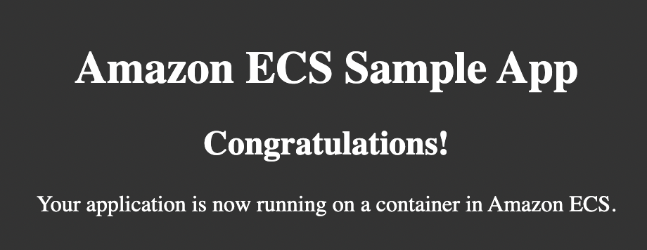

# Welcome to your CDK TypeScript project  
## Checkout Steps  
1. List task definition
    ```sh
    aws ecs list-task-definitions --profile ${PROFILE_NAME}
    ```
2. List service
    ```sh
    aws ecs list-services --cluster fargate-windows-cluster --profile ${PROFILE_NAME}
    ```
3. Describe the running service
    ```sh
    aws ecs describe-services --cluster fargate-windows-cluster --services fargate-windows-service --profile ${PROFILE_NAME}
    ```

## What Task Do  
