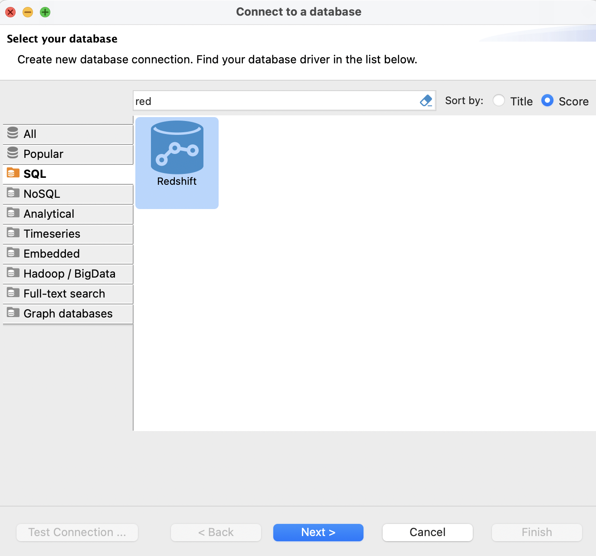
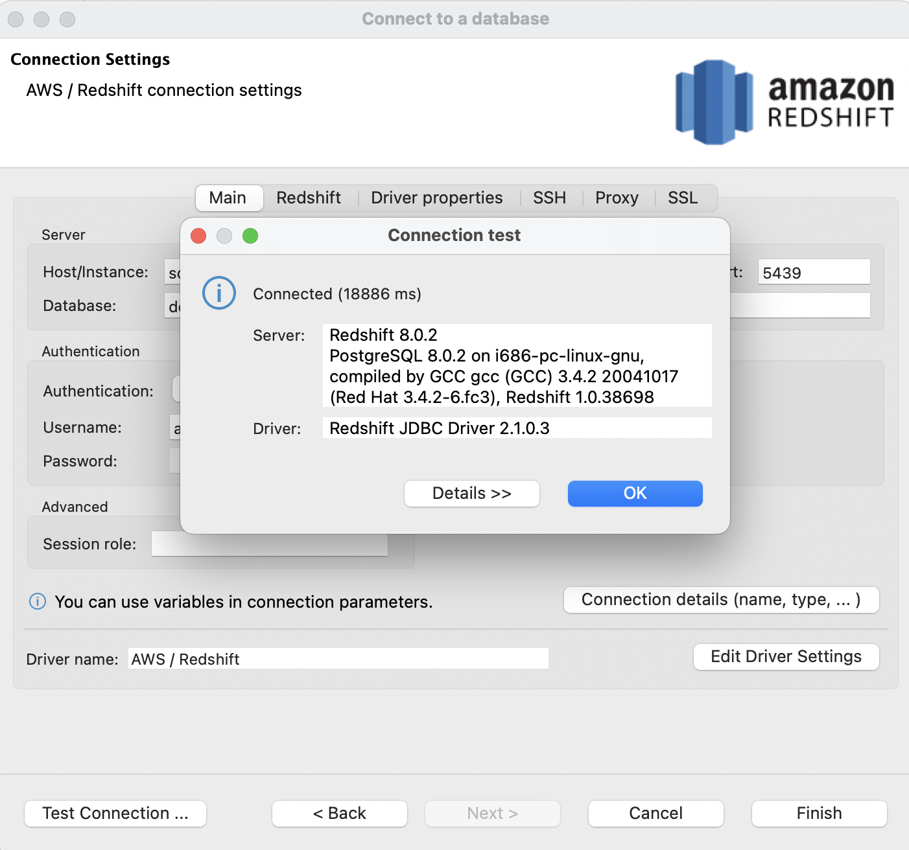

# redshift-lab  
## Connect to the Redshift cluster  
1. Login with DBeavor  
     
2. Fill in necessary connection information  
     

## Import the NYC taxi data into the cluster   
1. Copy data into a designated bucket  
   ```sh
   PROFILE_NAME="scott.hsieh"
   BUCKET_NAME="emr-serverless-630778274080"
   aws s3 cp s3://nyc-tlc/trip\ data/ s3://${BUCKET_NAME}/nyc-taxi/ --exclude "*" --include "yellow_tripdata_2021-*.parquet" --recursive --profile ${PROFILE_NAME}
   ```
2. Copy data into the Redshift cluster  
   ```
   ```
3. 